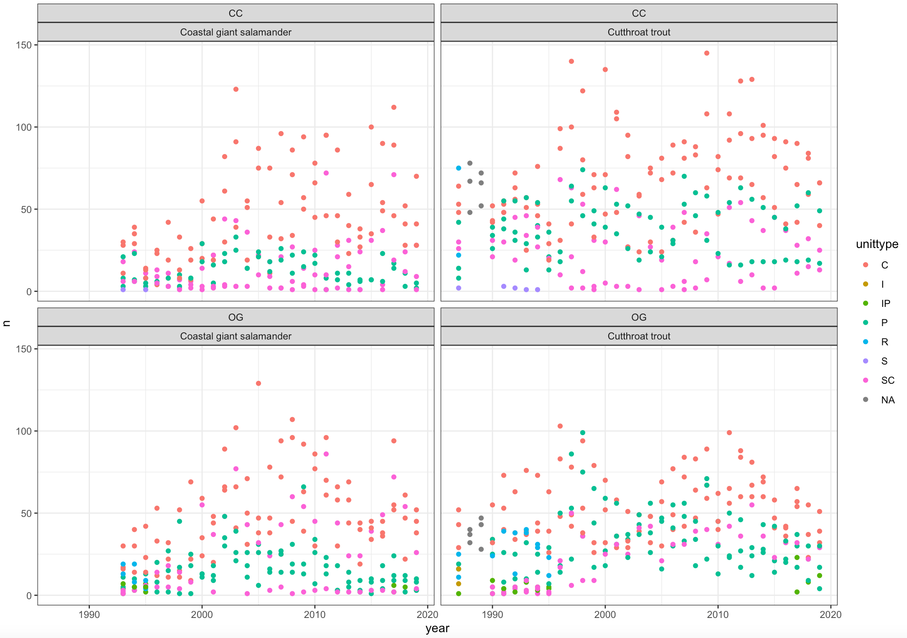
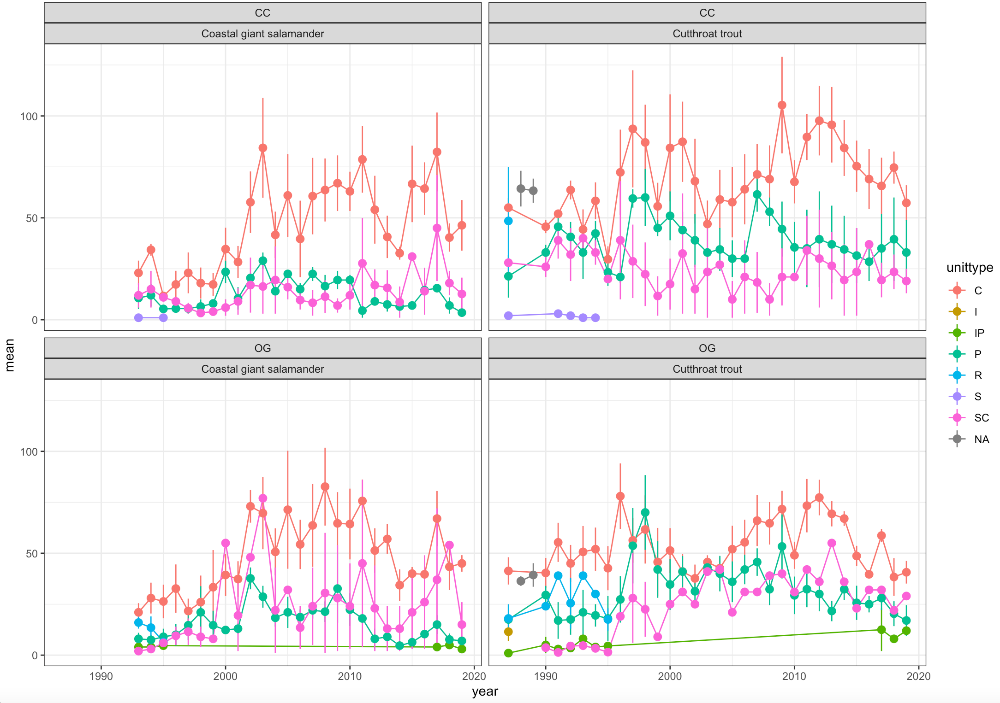

# Exploring the data 

We are interested in exploring the potential impact of different land management strategies and habitats on abundance and biomass of cutthroat trout and coastal giant salamander. 

## Plotting abundance through time and space

To begin with it would be good to know how abundance of both species has changed through time. 

Use glimpse() to look at your data set once more. If we wanted to look at abundance how might we go about it? 

> Hint - we can use the function count() to derive abundances. 

<details><summary> **Click-me to check your analysis** </summary>

This data set contains a lot of individual information, which is great and we will come back to that later. But we want to be able to look at species abundance to start with so we will need to do a little bit of data wrangling. Try running the following on your data set;

```{r}
vert_counts <- vertebrates %>% 
  count(year, species, section, reach, unittype) 
```

Use glimpse() to look at your new data frame, do you understand what has been calculated? use the `#` to comment on your new piece of code. 

</details>
<br />

Now that we have some abundance data lets have a look at how these have changed through time. Run the following piece of code;

```{r}
vert_counts %>% # Pipe vert_counts into ggplot
  ggplot(aes(x = year, y = n)) + # Plot year against abundance (n)
  geom_point() + # Produce a scatter plot
  theme_bw() + # Set the theme to a basic black and white theme 
  facet_wrap(section~species) # produce a separate plot for different sections and species, sections by row, species by collumn
```

Look at what you have produced, is it very meaningful? There is some information in these plots about the land management for each reach of creek but no further spatial information has been included, each reach is 150 meters long and contains several different habitat types. We may have clumped too much data into these figures. But we can separate this out a little further, try this;

```{r}
vert_counts %>% # Pipe vert_counts into ggplot
  ggplot(aes(x = year, y = n, colour = reach)) + # Plot year against abundance (n), colour by reach
  geom_point() + # Produce a scatter plot
  theme_bw() + # Set the theme to a basic black and white theme 
  facet_wrap(section~species) # produce a separate plot for different sections and species, sections by row, species by collumn

```

Now we have added a little more resolution to our figures by splitting the data into 50 meter sections, but do we think it might be more informative to have habitat information presented instead of which reach division the abundance data were collected from? See if you can manipulate the last chunk of code to produce the following figure (Figure 3.1).

```{r, eval=TRUE, echo=FALSE, out.width="90%", fig.alt= "Abundance by year, coloured by habitat", fig.cap ="Abundance by year, coloured by habitat"}

```

This analytical process might have given us some idea of the abundances across year, reach and habitat type but its still pretty tricky to pull out much of a pattern from these data. So we need to do some more data wrangling to produce a plot that is more meaningful and easier to interpret. Look again at your plots, do you think that there are multiple data points per year and unittype? Could these be summarised more effectively by some measures of central tenancy and spread?

Try running the following to make a summary tibble;

```{r}
summary <- vert_counts %>%
  group_by(year, species, section, unittype) %>% 
  summarise(mean=mean(n),
            sd=sd(n),
            n=n())
summary

```

Have a look at the tibble produced, do you understand what each line of the above code has done? Try adding comments `#` to your code. 

It would also be useful to know the standard error of the mean as well. We can use the `mutate` function to add additional columns onto our summary stats table. Remember we can calculate the standard error of the mean using;

$$
SEM = \frac{SD}{\sqrt{n}}
$$
Add the following line of code to the end of the previous chunk, don't forget to include the piping syntax `>%>`;

```{r}
mutate(sem = sd/sqrt(n))
```

Your summary tibble should now look like this (note that this is just an exert, yours will be larger);

```
> summary
# A tibble: 386 × 8
# Groups:   year, species, section [120]
    year species         section unittype  mean    sd     n   sem
   <dbl> <chr>           <chr>   <chr>    <dbl> <dbl> <int> <dbl>
 1  1987 Cutthroat trout CC      C         55    8.19     3  4.73
 2  1987 Cutthroat trout CC      P         21.3 18.1      3 10.5 
 3  1987 Cutthroat trout CC      R         48.5 37.5      2 26.5 
 4  1987 Cutthroat trout CC      S          2   NA        1  NA   
 5  1987 Cutthroat trout CC      SC        28    2.83     2  2   
 6  1987 Cutthroat trout OG      C         41.3 11.6      3  6.69
 7  1987 Cutthroat trout OG      I         11.5  6.36     2  4.5 

```

You might notice that there are some `NA` values stored here. This is because where there is only one data value per category combination (e.g. 1987, Cutthroat trout, CC, S) we cant calculate a standard deviation or a standard error of the mean. We don't want these `NA` values to cause future errors so we are just going to replace them with `0`. Add the this line to your last chunk (remember to pipe).

```{r}
mutate(sem = replace_na(sem, 0))
```

Now we can use this

```{r}
summary %>%
  ggplot(aes(x = year, y = mean, colour = unittype)) +
  geom_line() +
  geom_pointrange(aes(ymax = mean+sem, ymin = mean-sem)) +
  theme_bw() +
  facet_wrap(section~species)

```

To produce plots that look like this;

```{r, eval=TRUE, echo=FALSE, out.width="90%", fig.alt= "Mean abundance by year, coloured by habitat", fig.cap ="Mean abundance by year, coloured by habitat"}

```

Once again make sure you understand what each line of code has done, try adding comments `#` to the script. Spend some time looking at these plots, what do they tell you? Remember that you have plotted mean and standard error for abundance across year, habitat, land management strategy and two species here, which gives you multiple questions you could ask of the data. It may be of interest to know that Mack Creek flooded in 1996. What impact (if any) did this have on our abundances? Remember to look at the variation in the data, don't just focus on the mean. 

> Note down some of your observations, interpretations or thoughts, we will have a class discussion around these in the last 20 minutes of the workshop.

## Comparing habitat and land management strategy impacts on abundance

We may wish to directly compare abundances between habitat and land management strategy (removing time as a variable). How do you think you might go about this? See if you can manipulate some of the above scripts to produce an appropriate plot;

> Hint - I would use geom_boxplot

What do these new plots tell you about differences in abundance in either trout or salamander species between different habitats/land management strategy?

> Note down some of your observations, interpretations or thoughts, we will have a class discussion around these in the last 20 minutes of the workshop.

## Bonus Challenge

Our original data set also contained data on salamander and trout standard length and weight. Have a go at exploring these data, do you think habitat or land management has any impact on the biomass of trout or salamanders? Think about the most appropriate plots you could produce to explore these questions. 

> Note down some of your observations, interpretations or thoughts, we will have a class discussion around these in the last 20 minutes of the workshop.

## Discussion

The last 20 minutes of this session will be used for a class discussion around the observations you have made from the plots produced. Think about any major patterns that have emerged, can you link these patterns back to any one single variable? 

## Before you leave

Please log out of posit Cloud before you leave and make sure you save your script, we will come back to it in future workshops. 

